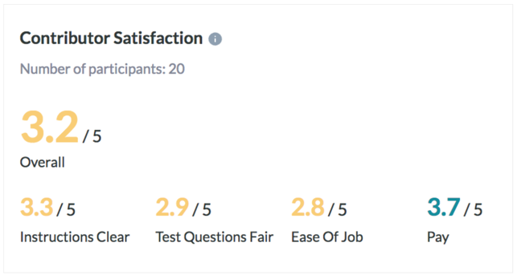

# Medical Image Annotation Job

## Data Labeling Approach

### Project Overview and Goal

**What is the industry problem you are trying to solve? Why use ML in solving this task?**

I want to accelerate the identification process of possible cases of pneumonia [1] in children, in a context where...

* Doctors have more requests (appointments) than the ones they can handle in a timely manner without compromising the patient’s health.
* Children from country (and rural poor areas) not always have easy access to medical professional but potentially they could have it to quick and primary identification technologies (x-rays); in case of positive or dubious cases, they could be transferred to places with more complex centers and proper medical assistance.
* Poor children could have access to machines (x-ray) outside the health insurance scope as a special precautionary Government Plan).

Why use ML…
* Possible big amount of information (dataset) even when the current one is still small (sample).
* It would be a fast identification process.
* It would help Doctors with the number of patients to treat and set priorities given particular cases
* It could reduce costs (particularly in a big implementation scale) 

[1] Until medical corroboration we will use the conditional.

### Choice of Data Labels

What labels did you decide to add to your data? And why did you decide on these labels vs any other option?

Does this x-ray image show the signs of pneumonia?
* Yes
* No
* Not sure

*Note*: For those contributors who pick “Not sure” label, maybe we could add an input so they can provide feedback. This, in cases of uneven answer distribution (example most of them failing) could help us at the time of improving our instructions, examples outside the mandatory task of monitoring the result and adjusting uneven cases. 

Possible answers are Yes/No in case of certainty and Not sure where “classificator” can express incertitude (and potentially share their interpretation)

## Test Questions & Quality Assurance

### Number of Test Questions

Considering the size of this dataset, how many test questions did you develop to prepare for launching a data annotation job?

This dataset has 118 rows. Figure Eight (in its Best Practices section for Test Questions) recommends having between 50 to 100. 
I talked with my mentor and we both agreed that a good formula would be 8 questions per every 100 rows. So, in this case we could have 8 or 9 test questions.
The rubric (as well) stipules: “You should plan to include at least 5% test questions to mix into your training set or about 1 test question for every 19 data points you want to label”.
We also want to have a proper distribution. For 2 real labels (Yes/No) each one should represent 50% (we want to train our contributors to all possibilities in our dataset, avoiding biases).
The label “Not Sure” is just to cover failing cases (where contributor cannot decide). We don’t provide “Not Sure” examples given that we would end biasing classificators and setting falsie scenarios: we are the ones who have to ensure answer certainty in the Quality process and the data which classificators are going to contrast against their answers.

### Improving a Test Question

Given the following test question which almost 100% of annotators missed, statistics, what steps might you take to improve or redesign this question?

First, we should check if the test question is clear enough.
Then, update instructions providing more data for the particular case (the one that has been widely missed).
Also, add an example related to this case.
After this, we could launch the job again, monitor results and check % results (even answer distribution)
Optionally: repeat process until we reach the desired level of confidence.

### Contributor Satisfaction

Say you’ve run a test launch and gotten back results from your annotators; the instructions and test questions are rated below 3.5, what areas of your Instruction document would you try to improve (Examples, Test Questions, etc.)

I would improve…
1.	Instructions
2.	Test questions
3.	Ease of job (how contributors access to the job)

## Limitations & Improvements

### Data Source

Consider the size and source of your data; what biases are built into the data and how might the data be improved?

This is a small dataset partially labeled (0/1). We could increase the dataset and have a well-balanced representation of each label (Yes/No) to avoid the bias by predominance.

### Designing for Longevity

How might you improve your data labeling job, test questions, or product in the long-term?

Since I expect that the dataset is going to increase in a relation of 1:1 (+1 every new patient) we should use a dynamic model instead of a static one. 

This model is going to be continuously trained in new data with its consequent learning. This will impact our Annotation Job, so we should add more information and examples.
We could extend the model to classify more than pneumonia in children.
Examples:
* Pneumonia in adults
* Pneumonia in animals
*Other pathologies like emphysema
For this we should make changes in our data point: add new labels, instructions, examples… And redefine the entire model and job, particularly for new pathologies like emphysema.

This, plus monitoring the results should ensure a well-designed model and job.

## Preliminary observations…

1.	When I started scoping the project, the trigger question was “Is this a case of pneumonia…?”. However, after some reflection, I switched to “Does this x-ray image show the signs of pneumonia?”.
Classificators probably are not going to be Doctors, so answering to “Is this a case of pneumonia?” would suppose and undercover diagnosis. Also, given the shortness but powerful impact of the question (read it aloud) we could propitiate 2 biases:

    * Push classificators to unconsciously flag everything as pneumonia (in their minds just as a precaution)

    * Open the doors of the middle path selection, “Not sure”, as a way of avoiding imperatives. Related to bias and this label, “Not Sure” (thought for failing scenarios) for logical reasons we avoid any example given that we query against certainties reserving doubt just as the last instance to improve our job description, particularly tips and examples.

We want (as well) to keep the focus on the x-ray image and its interpretation, not try to “diagnose” nor give space to the human emotion or empathy (for the sake of the work, we should avoid any possible subjectivity).

2.	In relation to the labels I chose “Yes/No/Not sure”, maybe at future (and after more research) I would change their order. Why…? Well, the interpretation of cloudiness on x-rays could be a little tricky (it can get worse if we have a dataset with most of the cases flagged as “positives” and/or several “positives” in row)the instinctive first reaction could be to pick Yes since it is the first one and the one in repetition. 

## Credits

[Figure Eight](https://www.figure-eight.com/): Job design [instructions-peview.html](instructions-preview.htm) is based on the template `Image Annotation > Image Categorization`. The job was tested, launched, monitored (and improved) through their platform.